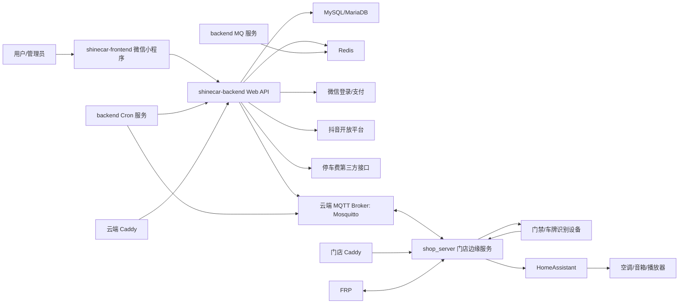

# ShineCar 业务架构与交接说明

> 本文档基于当前工作区代码、部署脚本，以及 2026-05-13 对远端服务器的只读核对结果整理。文档不记录密钥、token、证书内容，只记录配置位置和运维入口。

## 1. 业务简介

ShineCar 是一个自助洗车业务系统，用户通过微信小程序完成登录、绑定手机号、绑定车牌、查看门店和工位、创建洗车订单、结束订单、充值、兑换优惠券等操作。后台负责订单、计费、支付、优惠券、用户和工位状态管理，并通过 MQTT 与门店边缘服务联动。门店边缘服务负责对接门禁设备、车牌识别、HomeAssistant 以及具体智能设备。

核心目标是把“用户小程序操作”和“门店物理设备动作”串起来：

- 用户下单后，后台创建订单、锁定工位，并通过 MQTT 通知门店执行联动。
- 门店边缘服务收到指令后执行开门、通电、语音播报、HomeAssistant 控制等动作。
- 门禁、车牌识别、GIO 状态等设备事件由门店边缘服务接收，再通过 MQTT 上报后台。
- 后台根据设备事件继续触发业务处理，例如车牌识别、门禁开关状态联动、订单提醒等。

## 2. 主项目说明

### 2.1 `shinecar-frontend`

仓库：

```text
git@gitee.com:topone4tvs/shinecar-frontend.git
```

定位：微信小程序前端，项目名“焕车生活小程序”。

技术栈：

- Taro 4
- Vue 3
- TypeScript
- Sass

主要页面：

- 首页：`pages/index/index`
- 个人中心：`pages/profile/index`
- 工位详情：`pages/business/station-detail/index`
- 用户分包：充值、充值历史、余额日志、手机号绑定、车牌绑定、协议页面
- 业务分包：店铺详情、券码兑换、订单列表、券码列表、场地整理返现提交
- 管理分包：订单、场地整理返现、充值、余额日志、停车费

关键配置：

- 小程序 AppID：`project.config.json`
- API 地址：`src/config/env.ts`
  - 开发：`http://127.0.0.1:8989`
  - 生产：`https://api.shinecar.club`
- 请求封装：`src/utils/request.ts`
- API 常量：`src/config/api.ts`

常用命令：

```bash
npm run dev:weapp
npm run build:weapp
```

发布方式：构建到 `dist/` 后通过微信开发者工具上传小程序。

### 2.2 `shinecar-backend`

仓库：

```text
git@gitee.com:topone4tvs/shinecar-backend.git
```

定位：核心业务后台，负责 HTTP API、业务数据、订单计费、支付、优惠券、MQTT 消息、异步队列和定时任务。

技术栈：

- Go
- Gin
- GORM / gorm-gen
- MySQL/MariaDB
- Redis
- MQTT
- robfig/cron
- Docker Compose

主要模块：

- `cmd/main.go`：程序入口，支持默认 Web + MQTT 合并启动，也支持子命令。
- `cmd/app/web.go`：HTTP API 服务。
- `cmd/app/mqtt.go`：MQTT 订阅处理服务。
- `cmd/app/mq.go`：Redis 延迟队列消费者。
- `cmd/app/cron.go`：定时任务服务。
- `internal/api`：HTTP Controller。
- `internal/service/order`：订单创建、结束、计费、订单通知、门禁状态业务处理。
- `internal/service/shop`：店铺、工位查询和状态判断。
- `internal/service/recharge`：充值、微信支付。
- `internal/service/coupon`：优惠券、抖音券码。
- `internal/mqtt`：MQTT client、topic、消息发送、消息接收分发。
- `internal/pkg/queue`：Redis 延迟队列。
- `internal/model`、`internal/query`：数据库模型和 query 代码。

运行模式：

| 模式 | 启动命令 | 线上服务 |
|---|---|---|
| Web / 默认 | `./shinecar_backend` | `shinecar_backend` |
| MQTT 接收 | `./shinecar_backend_mq mq` | `shinecar_backend_mq` |
| Redis 队列消费 | `./shinecar_backend_mq mq` 内部注册队列消费者 | `shinecar_backend_mq` |
| Cron 定时任务 | `./shinecar_backend_cron cron` | `shinecar_backend_cron` |

主要 HTTP API：

- `POST /oauth/miniprogram/:platform`：小程序登录。
- `POST /user/phone/bind/:platform`：绑定手机号。
- `POST /user/vehicle-plate/add`：绑定车牌。
- `GET /shop/list`：门店列表。
- `GET /shop/detail/:id`：门店详情。
- `GET /shop/station/detail`：工位详情。
- `POST /order/create`：创建订单。
- `POST /order/finish/:id`：结束订单。
- `GET /order/current`：当前订单。
- `GET /recharge/list`、`POST /recharge/create`：充值相关。
- `GET /coupons/index`、`POST /coupons/exchange`：券码相关。
- `POST /notify/pay/wechat`：微信支付回调。
- `POST /notify/douyin/webhook`：抖音 webhook。
- `POST /shop/super-command`：管理员设备/订单超管命令。

关键配置：

- 本地配置：`config/config.dev.yaml`
- 线上配置：`config/config.online.yaml`
- 远端生效配置：`/data/www/backend/config/config.yaml`
- 证书目录：`config/certs/`

### 2.3 `shop_server`

仓库：

```text
git@gitee.com:topone4tvs/shop-server.git
```

定位：门店边缘服务，运行在门店现场服务器，连接上游业务后台 MQTT 和本地设备。

技术栈：

- Go
- Gin
- Paho MQTT
- HomeAssistant REST API
- Docker Compose

主要模块：

- `cmd/main.go`：启动 MQTT 路由、HTTP 服务和设备管理。
- `internal/service/router.go`：订阅 MQTT command topic，转换并执行设备命令。
- `internal/service/converter.go`：MQTT 消息转换为设备命令。
- `internal/service/device.go`：设备命令执行、门禁状态、复合指令。
- `internal/service/ha_service.go`：HomeAssistant 控制。
- `internal/server/http.go`：门禁设备 HTTP 回调入口。
- `internal/server/plate_handler.go`：车牌识别、GIO、串口、截图等设备消息结构和处理。
- `cmd/heartbeat_monitor`：独立心跳监控进程，用于心跳丢失时自动重启 `shop_server`。

HTTP 入口：

- `GET /health`
- `POST /api/plate/station/:station_id`
- `POST /api/device/heartbeat/:station_id`
- `POST /api/device/gio/:station_id`
- `POST /api/device/serio/:station_id`
- `GET /api/status`
- `GET /api/status/station/:station_id`

关键配置：

- 本地配置：`config/env.dev.yaml`
- 线上配置：`config/env.online.yaml`
- 远端生效配置：`/var/www/projects/shop_server/config/env.yaml`

当前门店配置中有两个工位：

- 店铺标识：`001`
- 工位标识：`001`、`002`
- 每个工位配置门禁 endpoint、HomeAssistant 空调、音箱、播放器等实体；通风设备暂未启用，控制方式待确认。

## 3. 项目关系



## 4. 主要业务场景

### 4.1 小程序登录和用户初始化

1. 小程序调用微信 `Taro.login()` 获取 code。
2. 小程序调用后台 `POST /oauth/miniprogram/wechat`。
3. 后台通过微信接口换取用户身份，创建或更新用户。
4. 后台返回 JWT token。
5. 后续请求通过 `Authorization: Bearer <token>` 鉴权。

涉及代码：

- 前端：`src/utils/request.ts`、`src/api/user.ts`
- 后台：`internal/api/oauth.go`、`internal/service/user`

### 4.2 查看门店和工位

1. 小程序调用 `GET /shop/list` 获取门店列表。
2. 进入门店详情或扫码进入工位详情。
3. 后台根据用户角色返回可用工位信息。
4. 普通用户会受工位状态、维护状态、当前订单等限制。
5. 管理员可以绕过部分普通用户限制，查看更多工位状态和管理入口。

涉及代码：

- 前端：`src/api/shop.ts`
- 后台：`internal/api/shop.go`、`internal/service/shop`

### 4.3 创建洗车订单

1. 小程序调用 `POST /order/create`，传入加密后的 `shop_id`、`station_id`。
2. 后台解密参数，获取当前用户。
3. 后台通过 Redis 分布式锁防止同工位并发下单。
4. 后台校验用户余额或体验券。
5. 后台检查店铺和工位是否可用。
6. 后台创建订单，更新工位 `work_status` 为使用中。
7. 后台向 MQTT 下发 `union_start` 指令。
8. `shop_server` 收到指令后执行订单开始联动，例如开门、通电。
9. 后台推送订单开始通知任务到 Redis 队列，MQ 服务异步处理语音/提醒类动作。

涉及代码：

- 后台：`internal/service/order/service.go`
- 后台 MQTT 下发：`internal/mqtt/message_sender.go`
- 门店 MQTT 接收：`shop_server/internal/service/router.go`
- 门店设备执行：`shop_server/internal/service/device.go`

### 4.4 结束洗车订单

1. 小程序调用 `POST /order/finish/:id`。
2. 后台计算订单时长和费用。
3. 后台扣减余额或核销券。
4. 后台更新订单状态和工位状态。
5. 后台向 MQTT 下发 `union_finish` 指令。
6. `shop_server` 执行订单结束联动，例如关门、断电。

关键风险：

- 计费逻辑复杂，涉及夜间价格、起步价、体验券、余额、管理员强制结束。
- 修改前必须跑订单计费相关单测。

### 4.5 车牌识别事件

1. 门禁/车牌识别设备 HTTP 推送到 `shop_server`。
2. `shop_server` 解析 `AlarmInfoPlate`。
3. `shop_server` 通过 MQTT 上报 `plate_recognition`。
4. 后台 MQTT 服务收到消息。
5. 后台根据车牌查询用户、店铺、工位，并按业务规则处理。

涉及 topic：

```text
shinecar/shop/{shopID}/station/{stationID}/event
```

实际 topic 生成逻辑以 `shop_server/internal/service/router.go` 和 `shinecar-backend/internal/mqtt/topic_builder.go` 为准。

### 4.6 门禁开关状态联动

1. 门禁设备上报 GIO 状态到 `shop_server`。
2. `shop_server` 判断门禁状态是否变更。
3. 状态变更时通过 MQTT 上报 `gate_status`。
4. 后台接收 `gate_status` 后更新工位 `gate_status`。
5. 如果该工位存在进行中订单，则后台触发内部事件逻辑并发送复合指令：
   - 门禁打开：空调 `turn_on`
   - 门禁关闭：空调 `turn_off`
   - 通风设备暂未启用，控制方式待确认
6. `shop_server` 收到 `composite_command` 后依次执行 HomeAssistant 子命令。

涉及代码：

- `shop_server/internal/server/http.go`
- `shop_server/internal/service/device.go`
- `shinecar-backend/internal/service/order/business_processor.go`
- `shinecar-backend/internal/mqtt/message_sender.go`

### 4.7 管理员超管命令

1. 小程序 admin 分包调用 `POST /shop/super-command`。
2. 后台校验管理员权限。
3. 后台按命令类型下发 MQTT 指令：
   - 开门
   - 关门
   - 通电
   - 语音播报
   - 超管结束订单
4. 门店边缘服务执行设备动作。

涉及代码：

- 前端：`src/api/shop.ts`
- 后台：`internal/service/admin/service.go`

## 5. 外部服务依赖

| 依赖 | 用途 | 配置位置 |
|---|---|---|
| 微信小程序 | 登录、手机号、前端运行平台 | `shinecar-frontend/project.config.json`、`src/config/env.ts` |
| 微信支付 | 充值支付、支付回调 | `shinecar-backend/config/config.*.yaml` |
| 抖音开放平台 | 团购券/券码兑换、webhook | `shinecar-backend/config/config.*.yaml` |
| MySQL/MariaDB | 业务主库 | `shinecar-backend/config/config.*.yaml`、Docker Compose |
| Redis | 锁、延迟队列、缓存 | `shinecar-backend/config/config.*.yaml`、Docker Compose |
| MQTT | 后台和门店指令/事件通道 | backend 和 shop_server 配置 |
| HomeAssistant | 门店智能设备控制 | `shop_server/config/env.*.yaml` |
| Caddy | HTTPS 和反向代理 | 远端 `/data/caddy`、`/var/www/caddy` |
| FRP | 内网穿透/远程访问 | 远端 Docker Compose |
| 停车费第三方接口 | 管理员代缴停车费 | `shinecar-backend/config/config.*.yaml` |

## 6. 部署与服务器

### 6.1 云端业务后台服务器

SSH 别名：

```text
scsv
```

只读核对结果：

```text
hostname: iZbp10ypnwhd468e5pmesyZ
docker compose dir: /data
backend dir: /data/www/backend
config: /data/www/backend/config/config.yaml
```

当前容器：

- `caddy`
- `mysql`
- `redis`
- `mosquitto`
- `frps`
- `shinecar_backend`
- `shinecar_backend_mq`
- `shinecar_backend_cron`

当前监听端口：

- `80` / `443`：Caddy
- `1883` / `9883` / `9001`：Mosquitto
- `3307`：MySQL 映射端口
- FRP 相关端口：`9201`、`20801`、`19801`、`19802`、`9700`、`9680`

部署命令：

```bash
cd /Users/topone4tvs/Projects/own/shinecar/shinecar-backend
./scripts/deploy-simple.sh online
./scripts/deploy-mq.sh online
./scripts/deploy-cron.sh online
```

线上检查：

```bash
ssh scsv "cd /data && docker compose ps"
ssh scsv "cd /data && docker compose logs --tail=100 shinecar_backend"
ssh scsv "cd /data && docker compose logs --tail=100 shinecar_backend_mq"
ssh scsv "cd /data && docker compose logs --tail=100 shinecar_backend_cron"
ssh scsv "ls -la /data/www/backend"
ssh scsv "ls -la /data/www/backend/config"
```

注意事项：

- 2026-05-13 核对时，`shinecar_backend` 容器显示 `unhealthy`，但进程存在。建议优先确认 `/health`、容器 healthcheck 和业务访问是否一致。
- 远端保留了多个二进制和配置备份，回滚可以基于 `*.backup.*` 文件进行。

### 6.2 门店边缘服务器

SSH 别名：

```text
scsp001
```

只读核对结果：

```text
hostname: shinecar-j4125
docker compose dir: /var/www
shop_server dir: /var/www/projects/shop_server
config: /var/www/projects/shop_server/config/env.yaml
```

当前容器：

- `caddy`
- `emqx`
- `frpc`
- `ha` / HomeAssistant
- `shop_server`

额外进程：

- `/var/www/projects/shop_server/heartbeat_monitor`

当前监听端口：

- `80` / `443`：Caddy
- `8080`：shop_server HTTP
- `8123`：HomeAssistant
- `1883` / `18083`：EMQX
- `40000`、`18554`、`18555` 等：门店本地/穿透相关服务

部署命令：

```bash
cd /Users/topone4tvs/Projects/own/shinecar/shop_server
./script/deploy-simple.sh online
```

线上检查：

```bash
ssh scsp001 "cd /var/www && docker compose ps"
ssh scsp001 "cd /var/www && docker compose logs --tail=100 shop_server"
ssh scsp001 "curl -s http://127.0.0.1:8080/health"
ssh scsp001 "ls -la /var/www/projects/shop_server"
ssh scsp001 "ls -la /var/www/projects/shop_server/config"
```

## 7. MQTT 协议概要

### 7.1 后台下发到门店

topic：

```text
shinecar/shop/{shopID}/station/{stationID}/command
shinecar/shop/{shopID}/command
```

常见 command：

- `union_start`
- `union_finish`
- `open_gate`
- `close_gate`
- `power_on`
- `power_off`
- `voice_play`
- `ha_notice`
- `ha_control`
- `composite_command`
- `heartbeat`

复合指令示例：

```json
{
  "type": "device",
  "command": "composite_command",
  "shop_id": "001",
  "station_id": "001",
  "message_id": "uuid",
  "timestamp": 1778631291,
  "data": {
    "scene": "gate_open_with_order",
    "continue_on_error": true,
    "commands": [
      {
        "command": "ha_control",
        "target": "air_conditioner",
        "action": "turn_on"
      }
    ]
  }
}
```

### 7.2 门店上报到后台

常见事件：

- `heartbeat`
- `plate_recognition`
- `device_event`
- `gate_status`
- `response`
- `status_response`

门禁状态示例：

```json
{
  "type": "device_event",
  "sub_type": "gate_status",
  "shop_id": "001",
  "station_id": "001",
  "timestamp": 1778631291,
  "data": {
    "type": "gate_status",
    "station_id": "001",
    "timestamp": 1778631291,
    "is_open": true,
    "status": "open",
    "source": 1,
    "value": 1,
    "channel": "gio_http"
  }
}
```

## 8. 数据和状态

核心数据表按代码模型推断包括：

- `sc_users`：用户。
- `sc_user_vehicles`：用户车牌。
- `sc_shops`：店铺。
- `sc_stations`：工位。
- `sc_orders`：订单。
- `sc_user_balances`：用户余额。
- `sc_user_transactions`：交易流水。
- `sc_recharge_orders`：充值订单。
- `sc_recharge_refunds`：充值退款。
- `sc_coupons`、`sc_group_coupons`、`sc_user_group_coupon_records`：券码相关。
- `sc_cleanup_rewards`：场地整理返现。

工位关键状态：

- `status`：工位基础状态。
- `work_status`：是否空闲、使用中、维护中。
- `gate_status`：门禁状态，当前新增设计中用于维护门禁实体开关状态。

## 9. 自测和回归命令

### 9.1 `shinecar-backend`

常用：

```bash
env GOCACHE=/private/tmp/shinecar_backend_go_cache go test ./internal/mqtt
env GOCACHE=/private/tmp/shinecar_backend_go_cache go test ./internal/service/order -run 'TestHandleStationGateStatusChanged'
env GOCACHE=/private/tmp/shinecar_backend_go_cache go test ./cmd -run TestNonExistent
```

全包：

```bash
env GOCACHE=/private/tmp/shinecar_backend_go_cache go test ./...
```

注意：当前 `internal/service/order` 全包测试存在既有计费用例失败，修改订单计费前需要单独处理。

### 9.2 `shop_server`

常用：

```bash
env GOCACHE=/private/tmp/shop_server_go_cache go test ./internal/service
env GOCACHE=/private/tmp/shop_server_go_cache go test ./internal/server
```

全包：

```bash
env GOCACHE=/private/tmp/shop_server_go_cache go test ./...
```

### 9.3 `shinecar-frontend`

开发：

```bash
npm run dev:weapp
```

生产构建：

```bash
npm run build:weapp
```

## 10. 运维排查清单

### 后台 API 访问异常

1. 检查 Caddy：

```bash
ssh scsv "cd /data && docker compose ps caddy"
ssh scsv "cd /data && docker compose logs --tail=100 caddy"
```

2. 检查 backend：

```bash
ssh scsv "cd /data && docker compose ps shinecar_backend"
ssh scsv "cd /data && docker compose logs --tail=200 shinecar_backend"
ssh scsv "curl -s http://127.0.0.1:7896/health"
```

3. 检查 MySQL / Redis：

```bash
ssh scsv "cd /data && docker compose ps mysql redis"
```

### MQTT 指令没有到门店

1. 检查云端 Mosquitto：

```bash
ssh scsv "cd /data && docker compose ps mosquitto"
ssh scsv "cd /data && docker compose logs --tail=100 mosquitto"
```

2. 检查 backend MQTT/MQ/Cron：

```bash
ssh scsv "cd /data && docker compose ps shinecar_backend_mq shinecar_backend_cron"
ssh scsv "cd /data && docker compose logs --tail=100 shinecar_backend_mq"
ssh scsv "cd /data && docker compose logs --tail=100 shinecar_backend_cron"
```

3. 检查门店 `shop_server`：

```bash
ssh scsp001 "cd /var/www && docker compose ps shop_server"
ssh scsp001 "cd /var/www && docker compose logs --tail=200 shop_server"
```

### 门店设备无响应

1. 检查 `shop_server` 健康状态：

```bash
ssh scsp001 "curl -s http://127.0.0.1:8080/health"
```

2. 检查 HomeAssistant：

```bash
ssh scsp001 "cd /var/www && docker compose ps ha"
```

3. 检查门店 MQTT：

```bash
ssh scsp001 "cd /var/www && docker compose ps emqx"
```

4. 检查心跳监控：

```bash
ssh scsp001 "ps aux | grep heartbeat_monitor | grep -v grep"
```

## 11. 已知风险和改进建议

1. 配置中存在明文密钥和 token。建议迁移到环境变量、服务器 secret 文件或密钥管理服务，并从仓库中清理。
2. `shinecar_backend` 线上容器当前显示 `unhealthy`，需要确认 healthcheck 是否配置错端口、命令不可用，或服务健康接口实际异常。
3. MQTT 协议需要单独维护正式文档，包括 topic、message type、command、event、字段含义、幂等策略。
4. 后台 Web、MQ、Cron 是三个运行角色，发布和回滚要分别处理，避免只发布 Web 导致异步逻辑没更新。
5. `shop_server` 当前配置仍偏单店铺。后续多店铺支持需要统一在 topic、配置、状态存储、设备事件上显式携带并校验 `shopID + stationID`。
6. 订单计费测试当前存在既有失败，后续改订单、余额、券码时应先修复或隔离这批用例。
7. 远端 Docker Compose 文件中有一些历史服务名和备份二进制，建议定期整理，降低误操作风险。
8. 门店设备依赖本地网络、HA、EMQX、FRP，出现问题时需要按“网络 -> 容器 -> shop_server -> HA -> 设备实体”的顺序排查。

## 12. 新人接手优先阅读顺序

1. 本文档。
2. `shinecar-backend/cmd/app/web.go`：了解 HTTP API。
3. `shinecar-backend/internal/service/order/service.go`：了解订单主流程。
4. `shinecar-backend/internal/mqtt/message_sender.go` 和 `message_handler.go`：了解 MQTT 上下行。
5. `shop_server/internal/service/router.go`：了解门店 MQTT 命令入口。
6. `shop_server/internal/server/http.go` 和 `plate_handler.go`：了解门店设备 HTTP 回调。
7. `shop_server/internal/service/device.go` 和 `ha_service.go`：了解设备执行逻辑。
8. `shinecar-frontend/src/api` 和 `src/pages`：了解小程序调用入口和页面结构。
